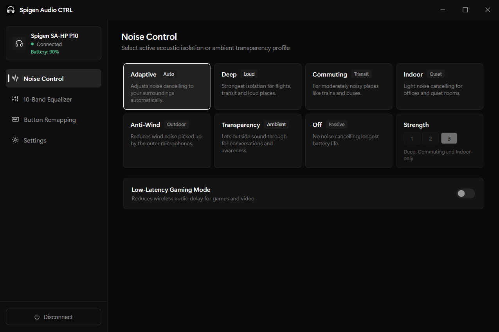
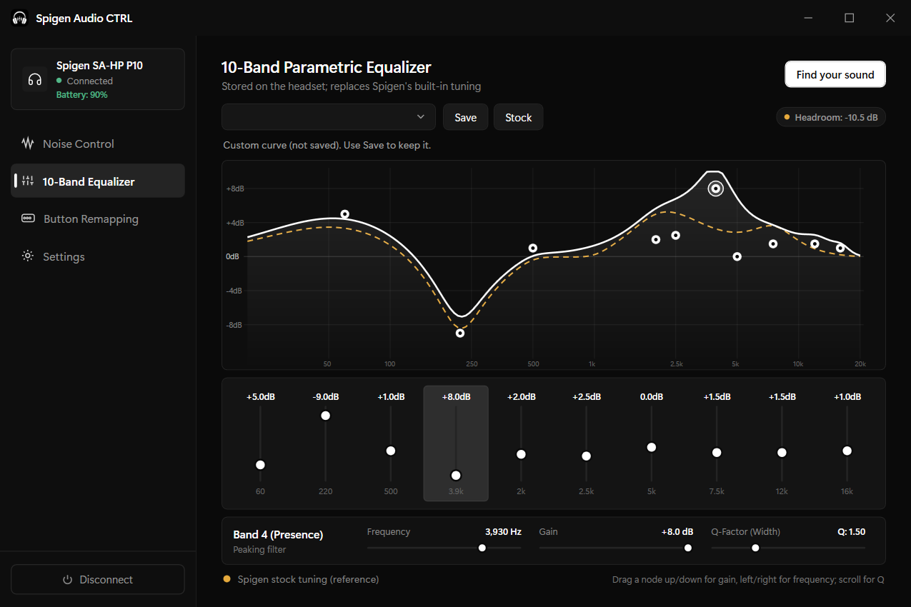
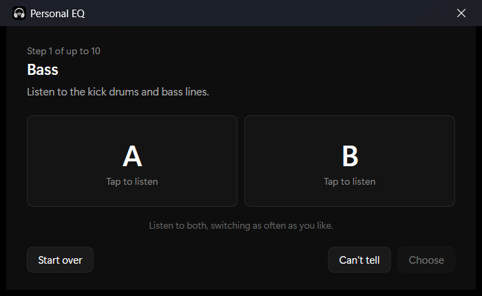
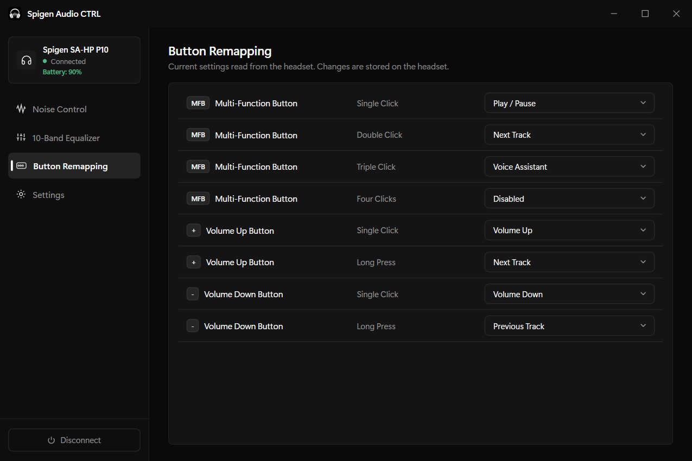
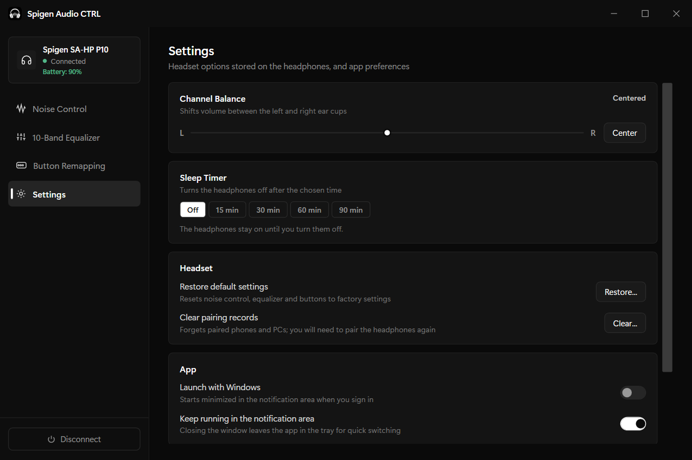

# SpigenAudioCTRL

An unofficial Windows desktop companion app for the **Spigen SA-HP P10** over-ear headphones. Built natively with C#, WPF, and WinRT Bluetooth LE GATT — no Electron, no middleware.


---

## Features

**Reads the headset's real state**
- On connect, the app reads the EQ, noise control mode, gaming mode, button mappings, channel balance, sleep timer and battery from the headset, and shows those, not built-in defaults
- Every change waits for the headset's confirmation. If a change is rejected or unconfirmed, the app re-reads the headset and shows what it actually has
- Battery (with charging state), gaming mode, balance and noise control are refreshed every 20 seconds, so changes made with the headset's own buttons show up

**Noise Control**
- Modes: Adaptive, Deep, Commuting, Indoor, Anti-Wind, Transparency, Off
- Three strength levels for Deep, Commuting and Indoor (the same range Spigen's app offers)
- Low-latency gaming mode

**Equalizer**
- 10 peaking filters stored on the headset: frequency 20 Hz to 20 kHz, gain -10 to +8 dB, Q 0.2 to 5.0
- The headset's custom EQ *replaces* Spigen's built-in tuning instead of stacking on it. Spigen's own presets all re-apply a deep 220 Hz cut against boominess, so the presets here start from that stock tuning:
  - *Spigen Default, Pop, Bass, Rock, Soft, Classic*: Spigen's presets for this headset
  - *Signature*: Spigen's tuning refined by about 1 dB (more sub-bass, smoother upper mids, less sibilance, a little air); a judgement call, not a measurement
  - *Airy, Warm, Relaxed, Vocal, Gaming*: small adjustments on top of Spigen's tuning
  - *Raw Driver*: no correction, for comparison only
- **Find your sound**: play any song, then pick between two versions, A and B, that the headset switches between live. Up to 10 choices build a personal curve on top of Spigen's tuning, saved as the "Personal" preset (see [how it works](#find-your-sound))
- Curve display uses real biquad filter math, with an optional overlay of the stock tuning
- Automatic headroom: the overall level is lowered by the peak of the combined curve, rounded up to 0.5 dB. For Spigen's default tuning this gives the same -5.5 dB Spigen uses
- Log-scale frequency control; drag nodes on the curve, scroll to change Q, or use the keyboard
- Saved presets persist in `%APPDATA%\SpigenAudioCTRL\settings.json`

**Button Remapping**
- Multi-function button: single, double, triple and four clicks
- Volume buttons: single click and long press
- Actions: Play/Pause, Previous/Next Track, Voice Assistant, Volume Up/Down, Gaming Mode, Disabled
- Gestures the headset reports as unsupported are disabled

**Settings**
- Channel balance (left/right)
- Sleep timer: turn the headphones off after 15, 30, 60 or 90 minutes
- Restore the headset's default settings, or clear its pairing records (both ask for confirmation)
- Diagnostics: copy the log for a bug report, or open the log folder

**Tray & startup**
- Closing the window keeps the app in the notification area; right-click the icon to switch noise control, EQ preset or gaming mode
- Optional launch with Windows, starting minimized to the tray
- Single instance: launching it again brings the existing window forward

**Connectivity**
- Finds the headset by its advertised name, then reconnects directly to the remembered address on later launches
- Reconnects automatically after the link drops, with backoff, until you press Disconnect

**Accessibility**
- All controls are reachable by keyboard, with a visible focus outline
- Screen-reader names on navigation, mode tiles, sliders and the EQ curve
- EQ curve keyboard control: Left/Right select a band, Up/Down change gain, Shift+Left/Right change frequency, Page Up/Down change width

---

## Screenshots

**Noise Control**



**Equalizer**



**Find your sound**



**Button Remapping**



**Settings**



---

## Download

Releases come in two variants:

| File | Size | Needs |
|------|------|-------|
| `SpigenAudioCTRL-<version>-win-x64.exe` | ~75 MB | Nothing; runs on any Windows 10 (19041+) or 11 PC |
| `SpigenAudioCTRL-<version>-win-x64-requires-dotnet8.zip` | ~25 MB | The [.NET 8 Desktop Runtime](https://dotnet.microsoft.com/download/dotnet/8.0) |

Most of the smaller build is Microsoft's Windows Runtime projection, which the Bluetooth code needs; WPF apps can't be trimmed.

Releases are not code-signed unless a certificate is configured (see below), so Windows SmartScreen may warn on first launch. Choose **More info** > **Run anyway**.

---

## Build

Requires the [.NET 8 SDK](https://dotnet.microsoft.com/download/dotnet/8.0).

```cmd
build.bat
```

This runs the tests, then writes both variants:

- `dist\SpigenAudioCTRL.exe` (standalone)
- `dist\requires-dotnet8\SpigenAudioCTRL.exe` (needs the .NET 8 Desktop Runtime)

Run from source:
```powershell
dotnet run
```

Run the tests:
```powershell
dotnet test tests/SpigenAudioCTRL.Tests/SpigenAudioCTRL.Tests.csproj
```

### CI and releases

[`.github/workflows/ci.yml`](.github/workflows/ci.yml) runs the tests and builds both variants on every push and pull request; the executables are attached to each run as artifacts. Pushing a tag such as `v2.0.0` also creates a GitHub release with those files.

### Code signing (optional)

To sign release builds, add two repository secrets:

- `SIGNING_CERT_BASE64`: a code-signing certificate (`.pfx`) encoded as base64
- `SIGNING_CERT_PASSWORD`: its password

The workflow signs both executables with `signtool` and a timestamp when the secret is present, and skips signing otherwise.

---

## Architecture

| Folder | Contents |
|--------|----------|
| `Device/` | `BluetoothService` (BLE connection, reconnect, request/response matching), `RcspProtocol` (framing, encoding, parsing), `HeadsetController` (confirmed headset state shared by the window and tray), `AncModes` |
| `Audio/` | `EqMath` (filter response, headroom), `EqPresets`, `PresetLibrary`, `SoundTuner` (the A/B "Find your sound" logic) |
| `Infrastructure/` | Settings, log file, tray icon, startup registration, single instance, dark title bar |
| `Views/` | Noise control, equalizer, buttons and settings views, and the Find your sound window |
| `tests/` | xUnit tests, using frames captured from Spigen's app talking to a P10 |

`MainWindow` is only the shell (title bar, navigation, connection status). Views render from `HeadsetController` and send changes through it, so the window and the tray always agree with the headset.

---

## Find your sound

"Find your sound" (the button on the equalizer page) works like the preference tests in OEM headphone apps. You play a song you know well in any app; because the equalizer runs on the headphones, the app can switch your music between two versions live.

It asks about five aspects in turn: bass, body, clarity, brightness and air. For each, the first comparison is "less vs. more" (±3 dB) and the second refines "how much" (1.5 or 4.5 dB in the chosen direction). "Can't tell" keeps the current amount and moves on, so it takes at most 10 choices. A and B are assigned at random, so the louder version isn't always on the same side.

The result is Spigen's tuning plus your adjustments, clamped to the headset's limits and saved as the "Personal" preset. Cancelling restores the equalizer you had before.

---

## Protocol

The SA-HP P10 uses Jieli's RCSP framing on BLE vendor service `A002` (write `0001`, notify `0002`):

```
command:  FE DC BA [flags] [opcode] [len_hi] [len_lo] [sn] [payload...] EF
response: FE DC BA [flags] [opcode] [len_hi] [len_lo] [status] [sn] [payload...] EF
```

| Opcode | Use | Payload |
|--------|-----|---------|
| `0xC1` | Read ADV info | 32-bit big-endian type mask; response is `[len][type][value]` TLVs (0 battery, 1 name, 2 key settings, 5 work mode / gaming, 12 balance) |
| `0xC0` | Write ADV info | One TLV, e.g. `04 02 [key] [gesture] [function]` (function 127 = disabled), `02 0C [balance 0-100]` |
| `0xC5` | System operation | `01` restore default settings, `02` clear pairing records |
| `0xFF` | Vendor custom | `FE 01 [type]` reads; `17 03 [mode] [scene] [level]` sets ANC; `20 [len] [mode] [master] [freq, gain, Q]...` sets EQ (16-bit LE, gain and Q x100); `14 04 [minutes LE] 00 00` sets the sleep timer (`FFFF` = off; `0` powers off immediately and is never sent) |

---

## Disclaimer

This is an independent, unofficial project. Not affiliated with or endorsed by Spigen Global Co., Ltd.

---

## License

[MIT](LICENSE) — Copyright (c) 2026 Safan Sulfikar
